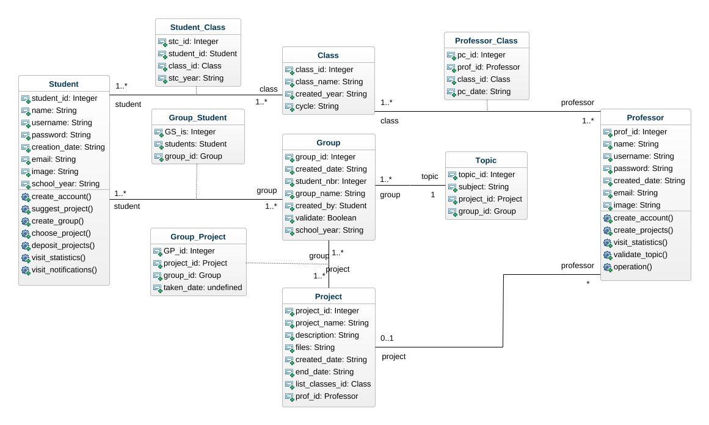

# Projects management: Back-End
    This is an academic project to develop a web app for projects management at ENSIAS (PFA, PFE, Applications). It provide to professor a set of tools to monitor and evaluate the progress of different groups of projects.
### Use case 

### Class diagram

## Installation

## Usage

